# 網路程式設計期末專題
# 遠端桌面控制

依賴套件
```
pip install eel
pip install pyautogui
```
---
<br>

# 書面報告
## 簡介
1.1目標與功能
同時使用UDP和TCP，模擬遠端桌面軟體的多數功能，方便使用者直接遠端控制裝置。

1.2研究動機
為了瞭解使用者在使用遠端桌面時的通訊流程，而進行遠端桌面運作的即時模擬。

1.3人力分配
潘子珉：50％
許倫豪：50％

1.4工作時程
2人 一個星期6小時
8個星期 共48小時


## 文獻
2.1 Chrome 遠端桌面
Chrome 遠端桌面都能透過最新網路技術讓你輕鬆連線自己的裝置，不論是要從家中存取公司電腦、在旅遊時查看家用電腦中的檔案，還是與好友或同事分享螢幕畫面。不受限於時間與地點地從遠端存取你的電腦，輕鬆查看檔案或執行程式。跨平台連線，例如使用電腦或 Android/iOS 裝置。不論選擇哪一種方式，只要有需要就能輕鬆存取你的所有電腦和檔案。
差異：本專題沒有同步音訊及跨平台連線

## 方法
3.1子模組
imageData → 處理畫面資料擷取與分割
Device → 儲存連線裝置的TCP及UDP地址
Supporter(繼承Device) → 儲存標記為Supporter的裝置地址及名稱
DevicesList(繼承List) → 處理Device或Supporter串列的儲存、查找與輸出

3.2 運作的流程 supporter(client)和accesser(client)對server發起TCP連線，並發送UDP訊息，由TCP保證UDP有收到，並且儲存UDP的地址。
由accesser向server發起對supporter的連線，server收到請求後交換雙方client的UDP地址。
supporterg收到accesser的地址後，不斷地截圖、分割資料、傳送UDP封包給accesser。
accesser收到封包確認完整後合併，並交給GUI顯示。
同時間，雙方client的一個Thread聽TCP，處理斷開連線的問題。
雙方只要一方關閉連線，包含程式中途停止，如果程式還在執行，就會回復到等待連線的狀態。

3.3循序圖

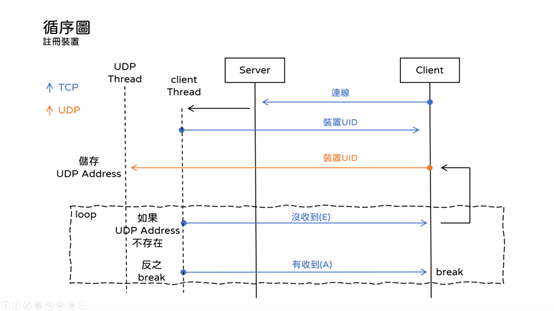
<br>
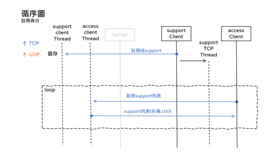
<br>
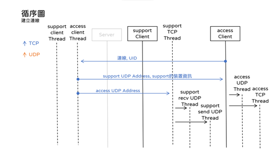
<br>
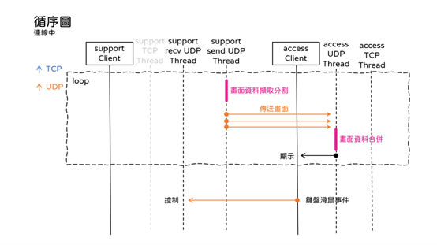
<br>
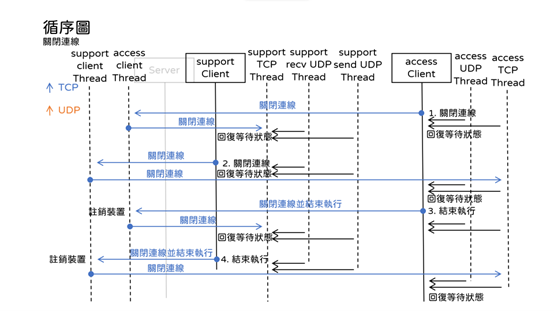

## 成果

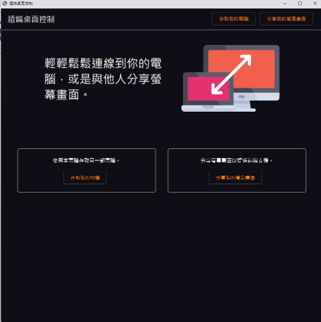
<br>
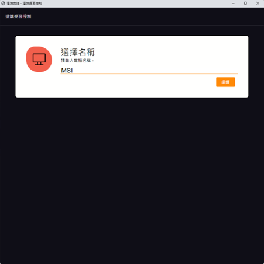
<br>
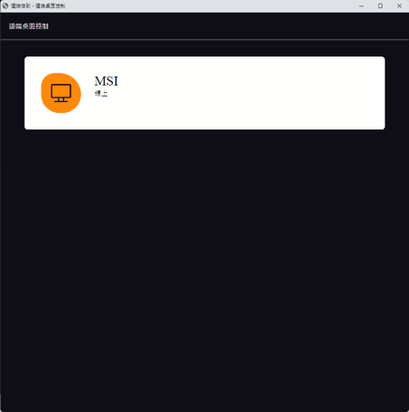
<br>
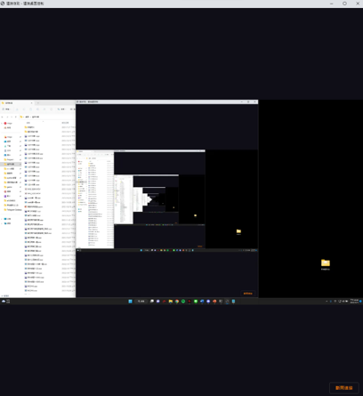
<br>
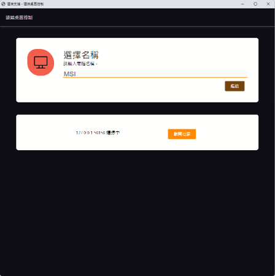
<br>
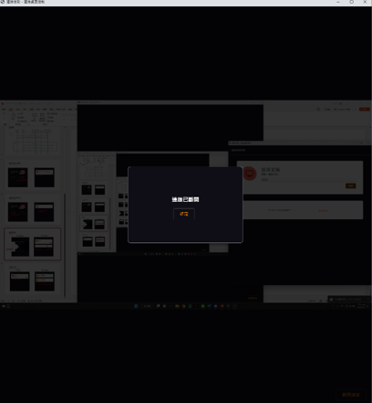
<br>
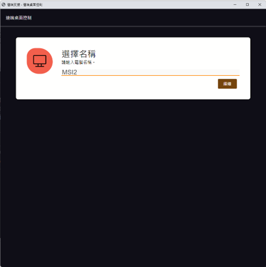
<br>
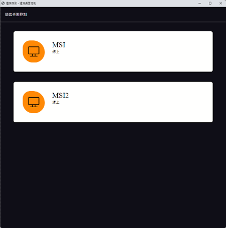

## 結論
好的編碼可以減少傳輸流量與時間，好的流程設計降低丟包風險，因此提升編碼方式、流程設計兩項，遠端桌面應能帶來良好的使用者體驗。

## 參考文獻
6.1 TW511教學網(2021)。大佬教你用 Python 手把手實現遠端控制桌面。https://tw511.com/a/01/35077.html(2022/12/12存取過)。